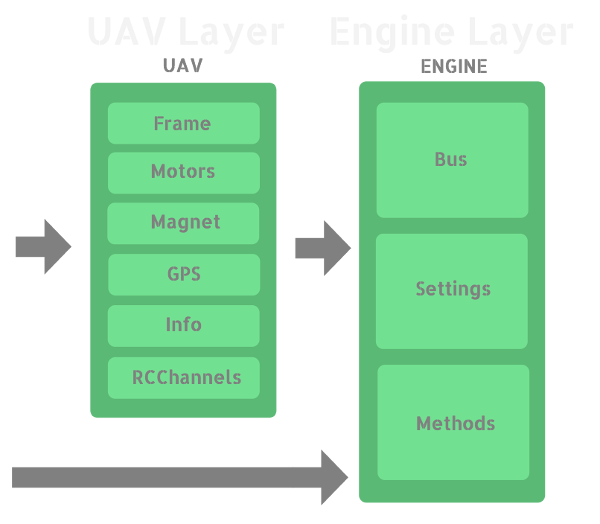

# aci-comm
Asctec Communication Interface Commander

Require C++11 Compiler.

## Usage example
```C++
#include "aci_comm_uav.hpp"

int main() {
    using namespace acc; 
    std::string port = "/dev/tty.USB0";
    
    // Initialize the UAV with serial port, 
    // baud rate and control mode
    UAV uav(port, B57600, CTRL_MODE::DIMC);
    
    try {
        // Enable all the motors read and write;
        uav.motors.enable_read(0).enable_write(0);

        // Start the aci and enable control mode
        uav.start().control_enable(true);

        // Write RPM motors 
        uav.motors.write({1500, 1500, 1500, 1500});

        // Read motors 1 RPM
        auto motor_speed_1 = uav.motors[0].read(); // -> 1500;

        uav.motors.write({1075, 1075, 1075, 1075});
        
    } catch (...) {
        // Stop and clean
        uav.stop();
    } 
    return 0;   
}
```

## aci-comm design
The aci-comm design is show in the following picture.
As you can see, there are to different interfaces in order to control the drone. 

The UAV is an high livel interface that manage
under the hood the Engine interface. 
Engine manage directly the original API C provided
by Asctec. 

One of the main differences between the two interfaces is that in the Engine interface the read and written values are raw, as the original API C.

The UAV interface convert the property values directly with their physical meaning. 

Both the interfaces throws errors when you insert 
wrong data or when you try to do illegal operations,
so you should wrap all the code in a try and catch block.


## UAV Interface

### UAV Frame
The Frame class contained in the UAV class, allow
the user to know about attitude and acceleration
of the drone.

### UAV Motors
The Motors class allow the user to control the 
motors of the drone: you can have only four or six motors. You set and read these values in RPM.

### UAV MagnetoMeters

### UAV GPS

### RCChannels

### UAV Info

### UAV Methods

## Engine Interface
Engine controls the Asctec API C, providing an abstraction layer that allow you to forget about the creation of the transmit thread, or to remember the exadecimal code for each read and write property.

You construct the Engine with a comunication bus: the only one that we provide is a SerialBus.

Than you add the propertys that you want to 
read and write, contained in two specific enums, and
start the Engine. 

After that you can read and write every property that
you have requested.

When all the jobs are done, you stop the engine.

```C++
#include "engine.hpp"

int main() {
    using namespace acc; 
    std::string port = "/dev/tty.USB0";

    // Pointer to the singlenton istance
    // of Engine.
    Engine<SerialBus>* ae;
    
    try {
        // Init Engine.
        ae = &Engine<SerialBus>::init(port, B57600);

        // Add accelerations read to packet 0
        ae->add_read(0, Var::acc_x, Var::acc_y, Var::acc_z); 

        // Add motor writes to packet 1
        ae->add_write(1, Cmd::DIMC_motor_1, 
                         Cmd::DIMC_motor_2, 
                         Cmd::DIMC_motor_3,
                         Cmd::DIMC_motor_4,
                         Cmd::ctrl_mode,
                         Cmd::ctrl_enabled,
                         Cmd::disable_motor_onoff_by_stick);

        // Start the engine.                 
        ae->start(); 

        // Write values for control mode
        ae->write(Cmd::ctrl_mode,                    0,
                  Cmd::ctrl_enabled,                 1,
                  Cmd::disable_motor_onoff_by_stick, 1);               

        // Write value to motor_1.
        ae->write(Cmd::DIMC_motor_1, 1000);

        // Read X acceleration.       
        auto acc_x = ae->read(Var::acc_x);
        
    } catch (...) {
        // Stop and clean
        ae->stop();
    } 
    return 0;   
}

```

## Examples
You can find a lot of usage examples in the *test.hpp*
file.

## Compile
We provide a Makefile that can compile the provided examples, or that build a shared library, or crosscompile on the Beaglebone Black.

You MUST add the original Asctec files in a folder
called *asctec*.

```bash
git clone https://github.com/UniTN-Mechatronics/aci-comm
cd aci-comm
// Insert the originals asctec files in the folder asctec
make
```

## License
See the LICENSE file for the MIT license text.

